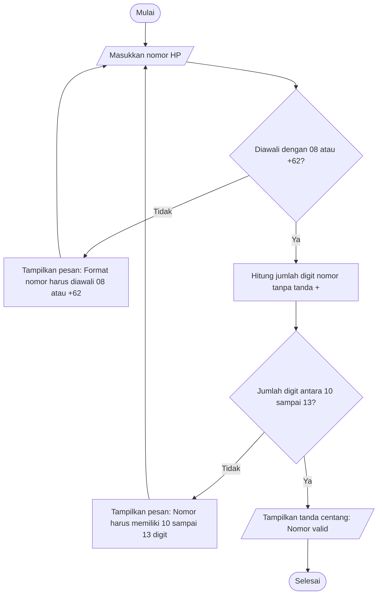

# Tugas Mandiri 02c — Flowchart Validasi Nomor WhatsApp

**Nama:** Husain Fadhilah Amal

## 1. Flowchart Validasi Nomor WhatsApp Indonesia

```mermaid
flowchart TD
    A([Mulai]) --> B[/Masukkan nomor HP/]
    B --> C{Diawali dengan 08 atau +62?}

    C -- Tidak --> D[Tampilkan pesan: Format nomor harus diawali 08 atau +62]
    D --> B

    C -- Ya --> E[Hitung jumlah digit nomor tanpa tanda +]

    E --> F{Jumlah digit antara 10 sampai 13?}

    F -- Tidak --> G[Tampilkan pesan: Nomor harus memiliki 10 sampai 13 digit]
    G --> B

    F -- Ya --> H[/Tampilkan tanda centang: Nomor valid/]
    H --> I([Selesai])
```